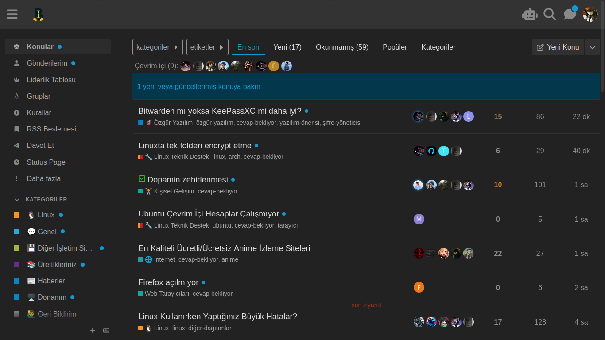

# btt.community Catppuccin Teması

Bu repoda, btt.community forum için hazırladığım [Catppuccin](https://catppuccin.com/) teması yer almaktadır. Modern ve göz dostu bir arayüz sunar.

---

## Öncesi & Sonrası

**Öncesi:**  

**Sonrası:**  

---

## Kurulum

### 1. Stylus Eklentisini Kur

Stylus, tarayıcıda özel temalar (userstyle) yüklemek için gereklidir.

- [Chrome için Stylus](https://chrome.google.com/webstore/detail/stylus/clngdbkpkpeebahjckkjfobafhncgmne)
- [Firefox için Stylus](https://addons.mozilla.org/firefox/addon/styl-us/)
- [Opera için Stylus](https://addons.opera.com/en/extensions/privacy_policy/27c0f4146c879f67a91b70f93f4eee4a01846fdd/)
- [Edge için Stylus](https://microsoftedge.microsoft.com/addons/detail/stylus/lmhdocknnhdcekdmjpheenofdadnopfg)

### 2. Temayı Kur

**Kolay Yöntem:**  
[userstyle.world sayfasından temayı yükle.](https://userstyles.world/style/22988)

**Alternatif: Repodan Manuel Kurulum**

1. [theme.user.css](./theme.user.css) dosyasını aç.
2. Dosyanın tamamını kopyala.
3. Tarayıcında Stylus eklentisini aç ve **"Yeni Stil Yaz"** butonuna tıkla.
4. Kopyaladığın kodu yapıştır ve kaydet.

---

## Eklenecekler

- [ ] Açık tema için Catppuccin Latte paleti

---
